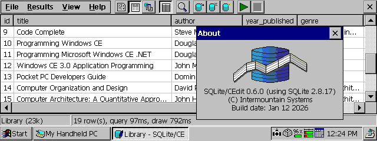

SQLite/CE: A transactional, relational database engine for Windows CE
---------------------------------------------------------------------

**SQLite/CE** is a port of SQLite 2.8.17 to Windows CE 2.0 and later, allowing Handheld, Palm-size and Pocket PCs to support complex relational databases and SQL queries. SQLite/CE can support your data-driven applications as a standalone DLL or can be used to directly manage personal databases with the **SQLite/CEdit** advanced query editor tool.

SQLite/CE is functional, but currently in pre-release state and may have oversights and bugs, particularly on post-CE 2.0 or non-SH3 targets where it has not yet been tested.
